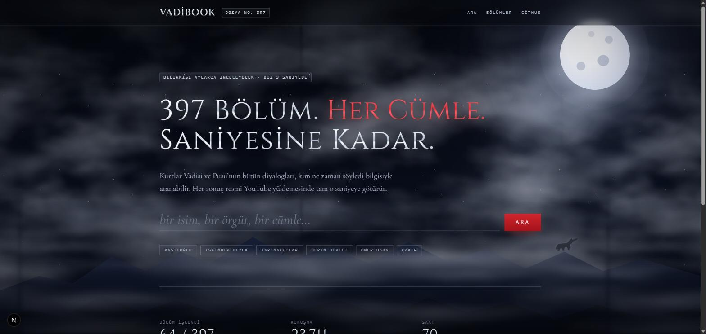
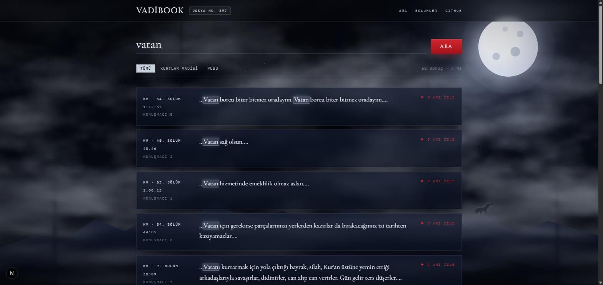

# vadibook

kurtlar vadisi'nin bütün bölümleri, aranabilir: **[vadibook.beydemir.dev](https://vadibook.beydemir.dev)**

397 bölüm. yüzbinlerce replik. bir isim yaz, bir cümle yaz, bir örgüt yaz; kim ne zaman demiş görürsün, tıklarsın, youtube'da tam o saniyeye gidersin.

## neden

eylül 2026'da savcılık, kurtlar vadisi'nin 397 bölümünü bilirkişiye inceletme kararı aldı. bilirkişi aylarca izleyecek, tutanak tutacak. biz dedik ki bu iş bir gece sürer, hem de herkese açık olur.

bir de şu var: 2003'ten 2016'ya kadar bu dizi türkiye'nin gündemiyle beraber yürüdü. kim kimi nerede tehdit etti, hangi örgüt hangi bölümde ilk kez anıldı, "kaşifoğlu" adı ilk ne zaman geçti — bunları merak eden çok, bakacak yer yok. artık var.

## nasıl

- bölümler pana film'in resmi youtube kanallarından alınıyor, sadece ses
- ses yerel makinede whisper ile yazıya dökülüyor, kelime kelime zaman damgalı
- konuşmacılar ayrıştırılıyor (kim ne zaman konuştu), sonra karakter isimleriyle eşleniyor
- hepsi bir arama motoruna giriyor; sitede aradığını 3 saniyede buluyorsun

her sonuç: seri, bölüm, dakika, konuşmacı, kısa bir alıntı ve resmi videoya giden zaman damgalı link. bölüm sayfalarında "kim ne zaman konuştu" çizelgesi var; dizide hangi karakterin ne kadar yer kapladığını bir bakışta görüyorsun.

## sınırlar

transkriptlerin tamamı yayımlanmıyor, sadece aramada eşleşen kısa alıntılar gösteriliyor. ses ya da video barındırmıyoruz; her şey pana film'in kendi yüklemelerine gidiyor. yani dizinin sahibine trafik gidiyor, bize sadece arama.

dizi bir kurgu. içinde gerçek kişilere benzeyen karakterler var; onların söyledikleri karakterlere aittir, bu site kimse hakkında bir iddiada bulunmaz.

konuşmacı etiketleri otomatik ve yer yer yanlış. karakter isimleri geldiğinde düzeltme düğmesi de gelecek.

## durum

- ses ve transkript üretimi sürüyor, 397 bölümün hepsi kataloglandı
- site yayında: [vadibook.beydemir.dev](https://vadibook.beydemir.dev)
- karakter isimleri (polat, memati, abdülhey…) bir sonraki adım
- ilişki grafiği ve "dosya" sayfaları onun ardından

2003-05 dönemi bölümlerinde konuşmacı ayrıştırma henüz kötü; sesin kalitesi farklı. üzerinde çalışılıyor.

## teknik

python, faster-whisper, sherpa-onnx, meilisearch, next.js. ayrıntı isteyen `pipeline/`, `web/` ve `docs/` altına baksın; kendin çalıştırmak istersen `pipeline/README.md` yeter.

## lisans

kod mit. `data/public/` altındaki bölüm kataloğu ve türetilmiş yapısal veri cc by 4.0. ses, video ve transkript metinleri bu repoda yok, dağıtılmıyor.

hak sahibiyseniz ve bir şeyin kaldırılmasını istiyorsanız issue açmanız yeterli.
